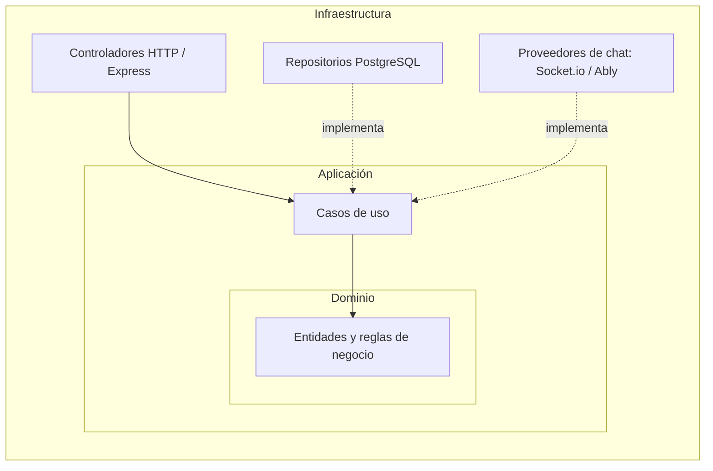
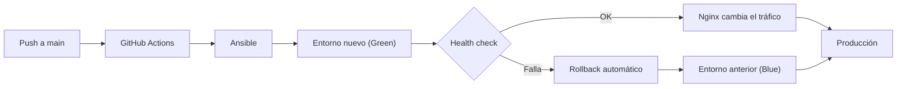
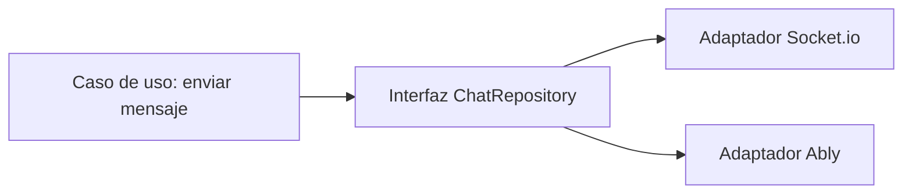
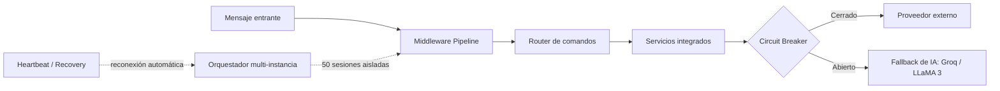
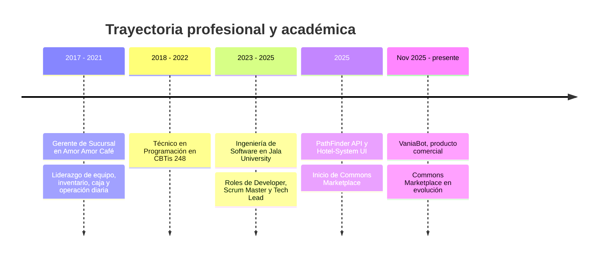

  

  

 

 

Soy desarrollador de software de **Oaxaca, México**, trabajo **100% remoto** y cuento con **3 años de experiencia** entre proyectos freelance y productos propios. Mi foco está en el **backend**, el **diseño de APIs REST** y la **arquitectura de software**, con una base sólida en **Node.js / TypeScript** y **Java / Spring Boot**.

Me gusta construir sistemas completos: desde el esquema de base de datos hasta el pipeline que los despliega en producción. No me conformo con que algo funcione; busco que sea **testeable, mantenible, observable y reversible**. Por eso mis proyectos incluyen pruebas automatizadas serias, infraestructura como código y estrategias de despliegue que permiten volver atrás en menos de un minuto.

Además de programar, tengo experiencia de **liderazgo técnico** como Scrum Master y Tech Lead en equipos ágiles, y vengo de una carrera previa de cuatro años como gerente de sucursal, lo que me dio criterio para decidir bajo presión y comunicar con claridad.

<table>
<tr>
<td width="50%" valign="top">

**Actualmente**

- Construyo **Commons Marketplace**, una plataforma de e-commerce full stack con despliegue propio.
- Mantengo y vendo **VaniaBot**, un bot comercial de WhatsApp con orquestación multi-instancia.
- Profundizo en **Java 21 y Spring Boot** a nivel profesional.

</td>
<td width="50%" valign="top">

**Me interesa**

- Arquitectura limpia y lógica de negocio testeable sin mocks.
- Infraestructura como código, redes y despliegues sin downtime.
- Sistemas resilientes: circuit breakers, fallbacks y recuperación automática.

</td>
</tr>
</table>

 

### Commons Marketplace

**Ecosistema full stack propio** &nbsp;|&nbsp; backend, client y deploy &nbsp;|&nbsp; 2025 – presente

Plataforma de e-commerce completa, diseñada y construida de punta a punta: aplicación web, API, base de datos relacional y pipeline de despliegue propio.

| Área | Detalle |
|:--|:--|
| **Stack** | Node.js / Express, Next.js, PostgreSQL |
| **API** | Más de 50 endpoints REST con autenticación y autorización basada en roles |
| **Arquitectura** | Onion Architecture sobre MVC, con lógica de negocio testeable sin mocks |
| **Testing** | 1,010 pruebas automatizadas, 80% de cobertura con Jest |
| **Tiempo real** | Chat con proveedores intercambiables (Socket.io / Ably) detrás de una interfaz de repositorio compartida |
| **CI/CD** | Pipeline propio con Ansible y GitHub Actions |
| **Resiliencia** | Despliegues Blue/Green con rollback en menos de 1 minuto mediante Nginx como reverse proxy |
| **Seguridad** | Exposición segura de servicios con VPN (Tailscale) |

<b>Ver arquitectura por capas (Onion Architecture)</b>

 

La lógica de negocio vive en el centro y no depende de frameworks, base de datos ni proveedores externos. Las dependencias apuntan siempre hacia adentro, lo que permite probar el dominio sin mocks y cambiar la infraestructura sin reescribir reglas de negocio.

<b>Ver estrategia de despliegue Blue/Green</b>

 

Dos entornos idénticos conviven detrás de Nginx. El tráfico se mueve al entorno nuevo solo cuando está sano, y si algo falla se revierte automáticamente al anterior en menos de un minuto. Toda la infraestructura está definida como código con Ansible y los servicios se exponen de forma privada con Tailscale.

<b>Ver detalle del chat en tiempo real</b>

 

El chat está desacoplado del proveedor de transporte. Tanto Socket.io como Ably implementan la misma interfaz de repositorio, de modo que se pueden intercambiar sin tocar los casos de uso ni las reglas de negocio.

 

### VaniaBot

**Producto comercial** &nbsp;|&nbsp; desarrollador único &nbsp;|&nbsp; nov 2025 – presente

Bot de WhatsApp construido con TypeScript y Baileys, **vendido comercialmente por grupo**. Es un producto real, con usuarios y mantenimiento continuo.

| Característica | Detalle |
|:--|:--|
| **Alcance funcional** | Más de 200 comandos en 9 dominios y más de 80 servicios integrados |
| **Orquestación** | Orquestador multi-instancia con 50 sesiones concurrentes y estado aislado por sesión |
| **Recuperación** | Heartbeat / Recovery Service para reconexión automática |
| **Resiliencia** | Middleware Pipeline con fallback de IA (Groq / LLaMA 3) y Circuit Breaker por proveedor |
| **Mantenimiento** | Refactor mayor v2.0.0: cerca de 6,800 líneas eliminadas en 177 archivos |
| **Entrega** | CI/CD con GitHub Actions y Docker, más de 502 commits |

 

### PathFinder API

**Portafolio** &nbsp;|&nbsp; desarrollador único &nbsp;|&nbsp; 2025

API RESTful de pathfinding con mapas, waypoints, obstáculos y optimización de rutas. Incluye autenticación **JWT**, control de acceso por roles (**RBAC**) y caché con **Redis** para acelerar cálculos repetidos.

 

### Hotel-System UI

**Frontend** &nbsp;|&nbsp; desarrollador único &nbsp;|&nbsp; 2025

Interfaz en Angular para un sistema de gestión y reservas de hotel, con arquitectura basada en componentes, enrutamiento y pruebas unitarias con Karma.

 

<table>
<tr>
<td width="180" valign="middle"><b>Lenguajes</b></td>
<td></td>
</tr>
<tr>
<td valign="middle"><b>Backend</b></td>
<td></td>
</tr>
<tr>
<td valign="middle"><b>Frontend</b></td>
<td></td>
</tr>
<tr>
<td valign="middle"><b>Bases de datos</b></td>
<td></td>
</tr>
<tr>
<td valign="middle"><b>DevOps e infraestructura</b></td>
<td></td>
</tr>
<tr>
<td valign="middle"><b>Testing</b></td>
<td></td>
</tr>
<tr>
<td valign="middle"><b>Herramientas</b></td>
<td></td>
</tr>
</table>

 

 

<table>
<tr>
<td width="50%" valign="top">

#### Arquitectura y diseño

- Onion Architecture sobre MVC
- Diseño de APIs REST con autenticación y roles
- Arquitectura orientada a microservicios
- Middleware Pipeline
- Circuit Breaker y cadenas de fallback
- Interfaces de repositorio intercambiables
- Principios SOLID y separación de responsabilidades

</td>
<td width="50%" valign="top">

#### Redes y seguridad

- Modelo TCP/IP y DNS
- Subnetting básico
- Reverse proxy con Nginx
- VPN con Tailscale
- Firewalls y acceso remoto por SSH
- Enrutamiento de tráfico Blue/Green
- Exposición segura de servicios

</td>
</tr>
<tr>
<td width="50%" valign="top">

#### Bases de datos

- Diseño de esquemas relacionales
- Optimización en PostgreSQL y MySQL
- Fundamentos de SQL transferibles a SQL Server
- Caché con Redis
- Modelado documental con MongoDB
- Supabase como backend gestionado

</td>
<td width="50%" valign="top">

#### Calidad y automatización

- Testing con Jest, Vitest y Karma
- 1,010+ pruebas y 80% de cobertura en proyecto principal
- CI/CD con GitHub Actions y GitLab CI/CD
- Contenedores con Docker
- Infraestructura como código con Ansible
- Estrategias de rollback automático

</td>
</tr>
<tr>
<td width="50%" valign="top">

#### Inteligencia artificial

- Integración con Groq SDK (LLaMA 3, Whisper)
- Cadenas de fallback multi-proveedor
- IA como capa de respaldo dentro de pipelines resilientes

</td>
<td width="50%" valign="top">

#### Metodología y colaboración

- Agile y Scrum
- GitHub Flow, Pull Requests y Code Review
- Liderazgo técnico (Scrum Master y Tech Lead)
- Comunicación en equipos remotos y distribuidos
- Toma de decisiones bajo presión

</td>
</tr>
</table>

 

| Principio | En la práctica |
|:--|:--|
| **Diseñar para probar** | Separo el dominio de la infraestructura para que las reglas de negocio se prueben sin mocks y con feedback rápido. |
| **Desacoplar lo que puede cambiar** | Proveedores de chat, de IA y de base de datos viven detrás de interfaces, así que cambiarlos no rompe el núcleo. |
| **Desplegar sin miedo** | Blue/Green, health checks y rollback automático hacen que publicar sea una operación rutinaria y reversible. |
| **Tolerar fallos** | Circuit breakers, heartbeats y recuperación automática mantienen el servicio vivo cuando un tercero falla. |
| **Automatizar lo repetible** | Todo lo que se hace dos veces termina en un pipeline de CI/CD o en un playbook de Ansible. |
| **Reducir complejidad** | Prefiero refactorizar y eliminar código antes que acumularlo, como en el refactor v2.0.0 de VaniaBot. |

 

 

 

 

 

<table>
<tr>
<td width="50%" valign="top">

#### Educación

**Ingeniería de Software**
Jala University, 2023 – 2025

Coordiné sprints, revisé Pull Requests de mis compañeros y lideré decisiones técnicas en equipos ágiles como Developer, Scrum Master y Tech Lead.

**Técnico en Programación**
CBTis 248, Oaxaca, 2018 – 2022

</td>
<td width="50%" valign="top">

#### Experiencia previa

**Gerente de Sucursal**
Amor Amor Café, 2017 – 2021

Ascendí de miembro del equipo a gerente en cuatro años. Lideré turnos, capacitación y estándares de servicio, gestioné inventario y caja, y optimicé procesos para reducir desperdicio y tiempos de espera.

Esa etapa me dio criterio operativo, comunicación clara y la costumbre de resolver problemas en tiempo real.

</td>
</tr>
</table>

 

<table>
<tr>
<td width="50%" valign="top">

#### Idiomas

| Idioma | Nivel |
|:--|:--|
| Español | Nativo |
| Inglés | B1: lectura técnica y escritura fluida, preparándome activamente para B2 |

</td>
<td width="50%" valign="top">

#### Objetivos

- Profundizar en Java 21 y Spring Boot a nivel profesional.
- Llevar mis proyectos hacia arquitecturas de microservicios.
- Seguir creciendo como Tech Lead en equipos remotos.
- Alcanzar el nivel B2 de inglés.

</td>
</tr>
</table>

 

¿Tienes un proyecto, una vacante o quieres conversar sobre arquitectura de software, backend o DevOps? Escríbeme.

 

  

<i>Primero hazlo funcionar, luego hazlo testeable, después hazlo reversible.</i>

