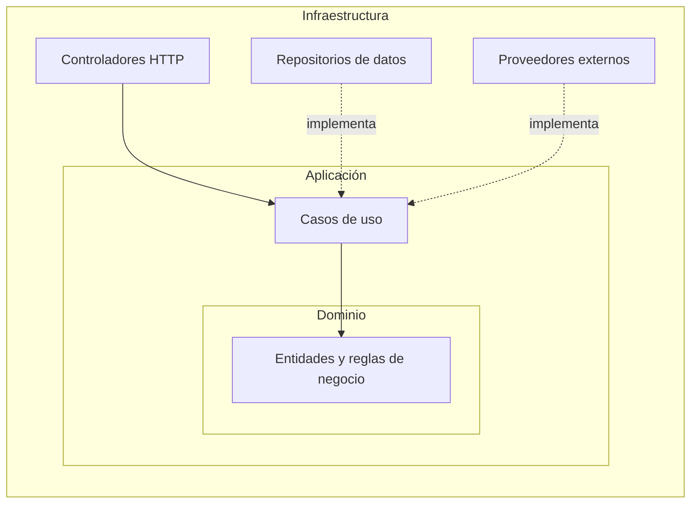
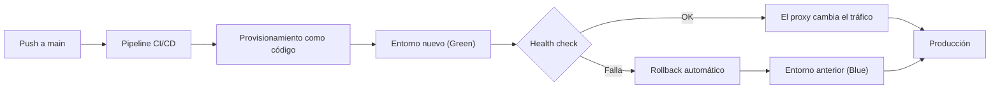
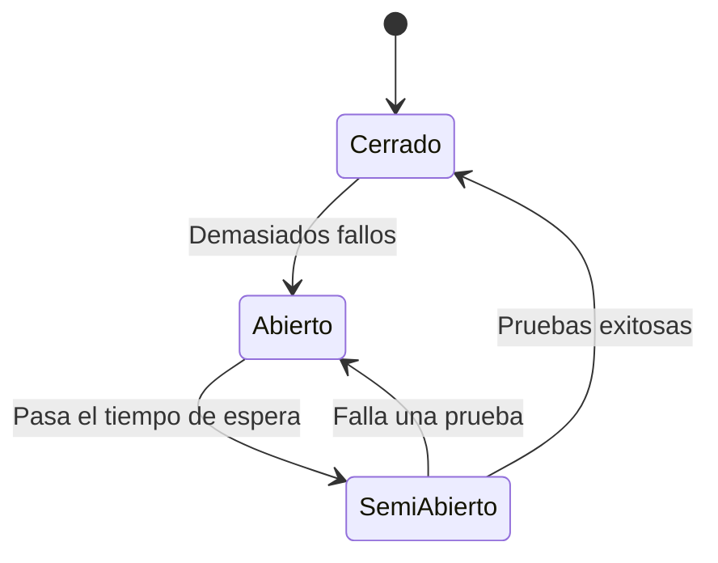
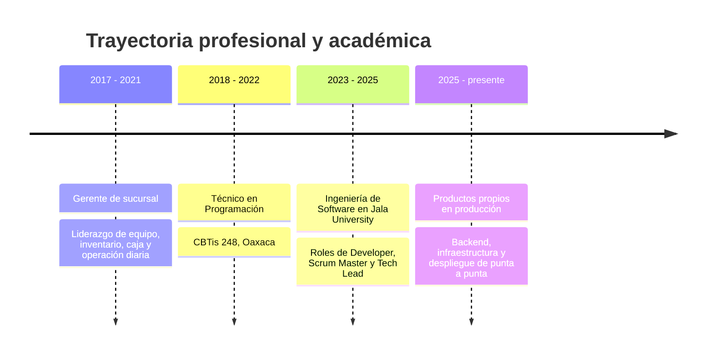

  

  

 

 

 

  

 

Soy desarrollador de software de **Oaxaca, México**, trabajo **100% remoto** y llevo **3 años** construyendo software entre proyectos freelance y productos propios. Mi terreno es el **backend**: diseño de APIs REST, arquitectura de software y todo lo que hace que un sistema llegue a producción y se mantenga sano. Mi base está en **Node.js / TypeScript** y **Java / Spring Boot**.

Me gusta cerrar el ciclo completo: desde el esquema de la base de datos hasta el pipeline que despliega el código. No me conformo con que algo funcione; busco que sea **testeable, mantenible, resiliente y reversible**. Por eso casi todo lo que hago incluye pruebas serias, infraestructura como código y estrategias de despliegue que permiten volver atrás sin drama.

Fuera del código, tengo experiencia de **liderazgo técnico** como Scrum Master y Tech Lead, y vengo de cuatro años como gerente de sucursal, una etapa que me dejó criterio para decidir bajo presión y comunicar con claridad.

 

 

 

 

<table>
<tr>
<td width="50%" valign="top">

#### Ahora mismo

Divido mi tiempo entre un **marketplace full stack** que despliego con Blue/Green y un **producto comercial de bots** que ya tiene clientes de verdad. Entre los dos practico todo lo que más disfruto: arquitectura limpia, concurrencia, resiliencia y automatización.

Si quieres ver código, mis repositorios fijados arriba son el mejor punto de partida; y si prefieres conversar, escríbeme.

</td>
<td width="50%" valign="top">

#### Lo que me interesa explorar

- Arquitectura limpia y lógica de negocio testeable sin mocks.
- Infraestructura como código, redes y despliegues sin downtime.
- Sistemas tolerantes a fallos: circuit breakers, fallbacks y recuperación automática.
- Microservicios sobre Java 21 y Spring Boot.
- IA como capa de respaldo dentro de pipelines resilientes.

</td>
</tr>
</table>

 

 

<table>
<tr>
<td width="200" valign="middle"><b>Lenguajes</b></td>
<td></td>
</tr>
<tr>
<td valign="middle"><b>Backend</b></td>
<td></td>
</tr>
<tr>
<td valign="middle"><b>Frontend</b></td>
<td></td>
</tr>
<tr>
<td valign="middle"><b>Bases de datos</b></td>
<td></td>
</tr>
<tr>
<td valign="middle"><b>DevOps e infraestructura</b></td>
<td></td>
</tr>
<tr>
<td valign="middle"><b>Testing</b></td>
<td></td>
</tr>
<tr>
<td valign="middle"><b>Herramientas</b></td>
<td></td>
</tr>
</table>

 

 

 

<table>
<tr>
<td width="50%" valign="top">

#### Arquitectura y diseño

- Onion Architecture sobre MVC
- Diseño de APIs REST con autenticación y roles
- Arquitectura orientada a microservicios
- Middleware Pipeline
- Circuit Breaker y cadenas de fallback
- Interfaces de repositorio intercambiables
- Separación de responsabilidades y principios SOLID

</td>
<td width="50%" valign="top">

#### Redes y seguridad

- Modelo TCP/IP y DNS
- Subnetting básico
- Reverse proxy con Nginx
- VPN con Tailscale
- Firewalls y acceso remoto por SSH
- Enrutamiento de tráfico Blue/Green
- Exposición segura de servicios

</td>
</tr>
<tr>
<td width="50%" valign="top">

#### Bases de datos

- Diseño de esquemas relacionales
- Optimización en PostgreSQL y MySQL
- Fundamentos de SQL transferibles a SQL Server
- Caché con Redis
- Modelado documental con MongoDB
- Supabase como backend gestionado

</td>
<td width="50%" valign="top">

#### Calidad y automatización

- Testing con Jest, Vitest y Karma
- Más de mil pruebas automatizadas y 80% de cobertura en mi proyecto principal
- CI/CD con GitHub Actions y GitLab CI/CD
- Contenedores con Docker
- Infraestructura como código con Ansible
- Estrategias de rollback automático

</td>
</tr>
<tr>
<td width="50%" valign="top">

#### Inteligencia artificial

- Integración con Groq SDK (LLaMA 3, Whisper)
- Cadenas de fallback multi-proveedor
- Modelos de IA como respaldo dentro de sistemas resilientes

</td>
<td width="50%" valign="top">

#### Metodología y colaboración

- Agile y Scrum
- GitHub Flow, Pull Requests y Code Review
- Liderazgo técnico (Scrum Master y Tech Lead)
- Comunicación en equipos remotos y distribuidos
- Toma de decisiones bajo presión

</td>
</tr>
</table>

 

 

Tres patrones que uso con frecuencia, resumidos en diagramas. Despliega cada uno para verlo.

<b>Onion Architecture: dominio al centro, infraestructura afuera</b>

 

La lógica de negocio no depende de frameworks, bases de datos ni proveedores externos. Las dependencias apuntan siempre hacia adentro, lo que permite probar el dominio sin mocks y cambiar la infraestructura sin reescribir reglas de negocio.

<b>Despliegue Blue/Green con rollback automático</b>

 

Dos entornos idénticos conviven detrás de un reverse proxy. El tráfico se mueve al entorno nuevo solo cuando está sano; si algo falla, se revierte al anterior en cuestión de segundos. La infraestructura se define como código y los servicios se exponen de forma privada.

<b>Circuit Breaker: aislar fallos de terceros</b>

 

Cuando un proveedor externo empieza a fallar, el circuito se abre y el sistema usa una alternativa en lugar de seguir golpeando un servicio caído. Después prueba con unas pocas peticiones y, si todo va bien, vuelve a la normalidad.

 

 

| Principio | En la práctica |
|:--|:--|
| **Diseñar para probar** | Separo el dominio de la infraestructura para que las reglas de negocio se prueben sin mocks y con feedback rápido. |
| **Desacoplar lo que puede cambiar** | Proveedores de chat, de IA y de datos viven detrás de interfaces, así cambiarlos no rompe el núcleo. |
| **Desplegar sin miedo** | Blue/Green, health checks y rollback automático convierten publicar en una operación rutinaria y reversible. |
| **Tolerar fallos** | Circuit breakers, heartbeats y recuperación automática mantienen el servicio vivo cuando un tercero falla. |
| **Automatizar lo repetible** | Todo lo que se hace dos veces termina en un pipeline de CI/CD o en un playbook. |
| **Reducir complejidad** | Prefiero refactorizar y borrar código antes que acumularlo. |

 

 

 

 

 

 

 

<table>
<tr>
<td width="50%" valign="top">

#### Educación

**Ingeniería de Software**
Jala University, 2023 – 2025

Coordiné sprints, revisé Pull Requests de mis compañeros y lideré decisiones técnicas en equipos ágiles como Developer, Scrum Master y Tech Lead.

**Técnico en Programación**
CBTis 248, Oaxaca, 2018 – 2022

</td>
<td width="50%" valign="top">

#### Experiencia previa

**Gerente de sucursal**
Amor Amor Café, 2017 – 2021

Ascendí de miembro del equipo a gerente en cuatro años. Lideré turnos, capacitación y estándares de servicio, gestioné inventario y caja, y optimicé procesos para reducir desperdicio y tiempos de espera.

Esa etapa me dio criterio operativo, comunicación clara y el hábito de resolver problemas en tiempo real.

</td>
</tr>
</table>

 

 

<table>
<tr>
<td width="50%" valign="top">

#### Idiomas

| Idioma | Nivel |
|:--|:--|
| Español | Nativo |
| Inglés | B1: lectura técnica y escritura fluida, preparándome activamente para B2 |

</td>
<td width="50%" valign="top">

#### Objetivos

- Profundizar en Java 21 y Spring Boot a nivel profesional.
- Llevar mis proyectos hacia arquitecturas de microservicios.
- Seguir creciendo como Tech Lead en equipos remotos.
- Alcanzar el nivel B2 de inglés.

</td>
</tr>
</table>

 

 

¿Tienes un proyecto, una vacante o quieres conversar sobre arquitectura de software, backend o DevOps? Escríbeme.

  

  

