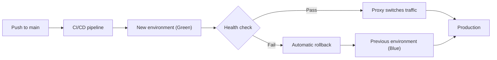
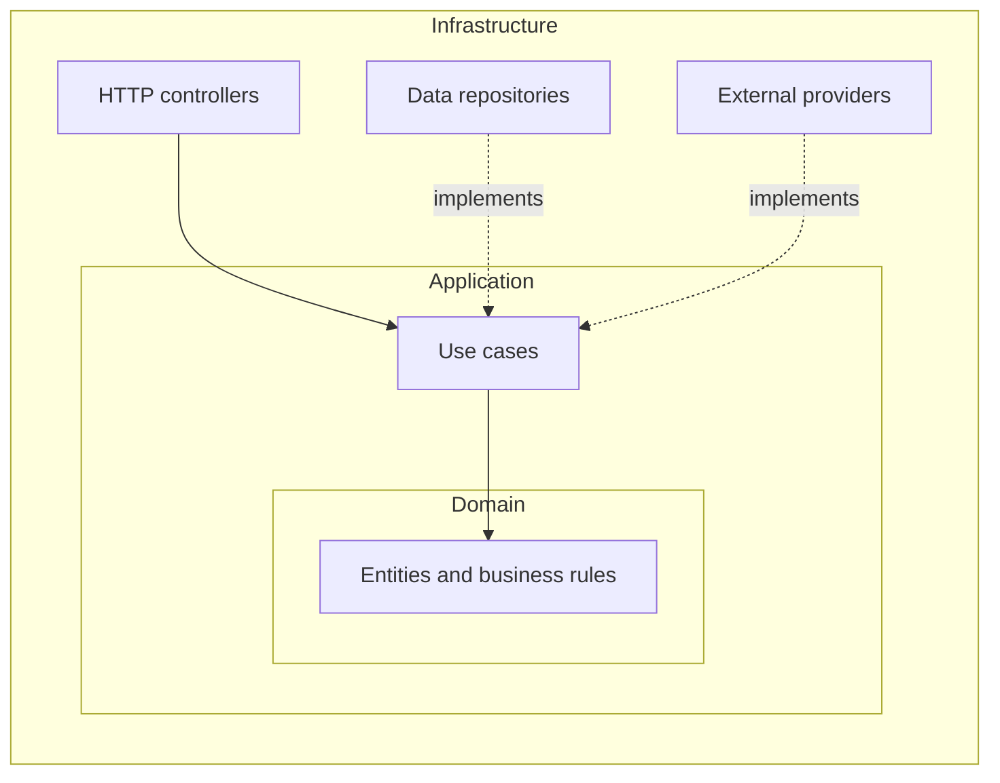

  

  

 

 

 

  

 

Backend-focused software developer from **Oaxaca, Mexico**, working **fully remote** with **3 years** of experience across freelance work and my own products. I design REST APIs, structure clean and testable architectures, and own the path from database schema to production deployment, with a strong base in **Node.js / TypeScript** and **Java / Spring Boot**.

I care about software that is **testable, resilient and reversible**. I've also led agile teams as **Scrum Master and Tech Lead**, and spent four years managing a café branch before moving into tech, which taught me to decide under pressure and communicate clearly.

  

 

 

- Building a **full-stack marketplace** deployed with Blue/Green and automatic rollback.
- Maintaining a **commercial bot product** with real customers.
- Going deeper into **Java 21, Spring Boot and microservices**.
- Working toward **B2 English**.

 

 

<table>
<tr>
<td width="180" valign="middle"><b>Languages</b></td>
<td></td>
</tr>
<tr>
<td valign="middle"><b>Backend</b></td>
<td></td>
</tr>
<tr>
<td valign="middle"><b>Frontend</b></td>
<td></td>
</tr>
<tr>
<td valign="middle"><b>Databases</b></td>
<td></td>
</tr>
<tr>
<td valign="middle"><b>DevOps</b></td>
<td></td>
</tr>
<tr>
<td valign="middle"><b>Testing</b></td>
<td></td>
</tr>
</table>

 

 

| Focus                       | What it looks like in practice                                                                        |
| :-------------------------- | :---------------------------------------------------------------------------------------------------- |
| **Design for testability**  | Onion Architecture keeps business logic independent of frameworks, so it can be tested without mocks. |
| **Ship without fear**       | Blue/Green deployments, health checks and automatic rollback make releases routine and reversible.    |
| **Tolerate failure**        | Circuit breakers, fallbacks and automatic recovery keep services alive when a third party fails.      |
| **Automate the repeatable** | CI/CD pipelines, Docker and infrastructure as code with Ansible.                                      |
| **Secure by default**       | Reverse proxies, VPN-only exposure, role-based access control and sensible network boundaries.        |

<b>Blue/Green deployment with automatic rollback</b>

 

<b>Onion Architecture</b>

 

 

 

 

 

 

 

 

<table>
<tr>
<td width="50%" valign="top">

**Education**

Software Engineering, Jala University (2023 – 2025)
Led sprints and technical decisions as Developer, Scrum Master and Tech Lead.

Technical Degree in Programming, CBTis 248 (2018 – 2022)

</td>
<td width="50%" valign="top">

**Previous experience**

Branch Manager, Amor Amor Café (2017 – 2021)
Promoted from team member to manager; led the team, managed inventory and cash, and optimized daily operations.

**Languages:** Spanish (native), English (B1, working toward B2)

</td>
</tr>
</table>

 

 

Have a project, an opening, or just want to talk backend and DevOps? Get in touch.

  

  

 

